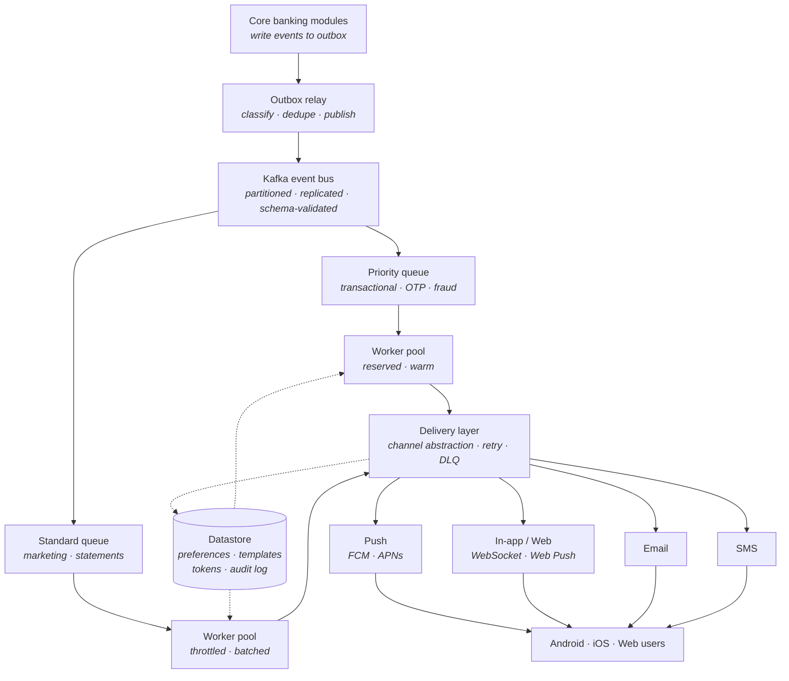
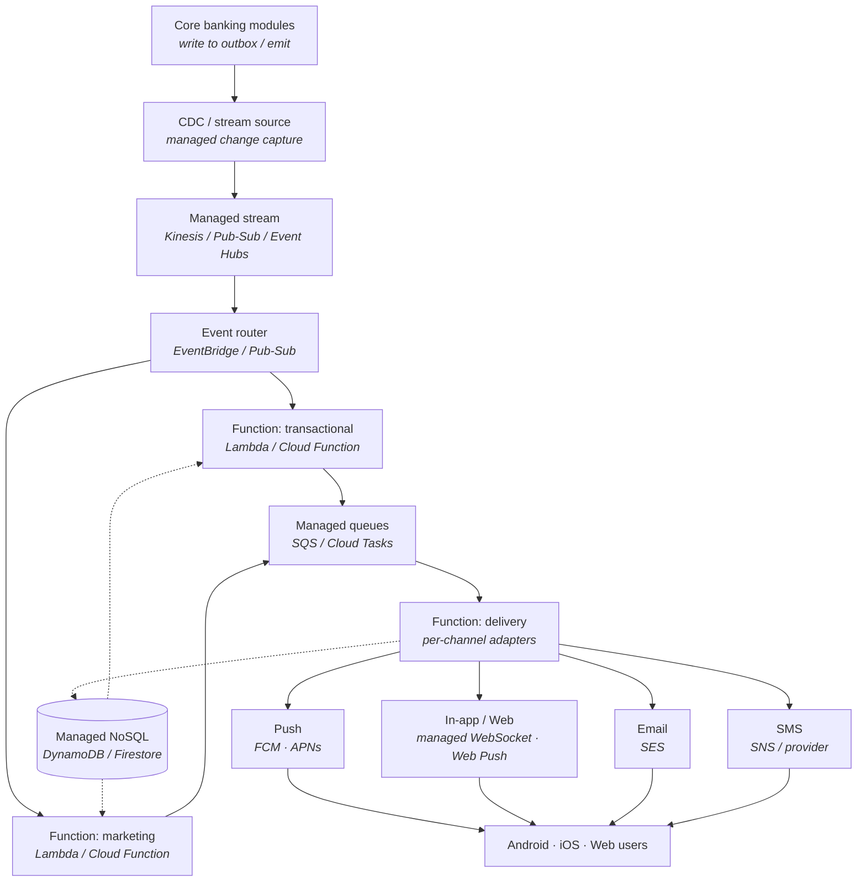

# System Design Document (SDD): High-Throughput Notification System

Main design document for the notification platform serving 1.5M active users across Android, iOS, and Web.

> **Scope of this document.** This is the main system design document. It defines goals and requirements, compares two candidate architectures, examines the core design considerations that apply to either, and lays out the migration plan. It sits above the per-approach architecture documents; component-level detail is owned by the teams assigned to each component.

---

## 1. Goals

**Context.** The current notification infrastructure experiences latency bottlenecks and tight coupling with core banking modules, affecting the user experience for our 1.5M active users across Android, iOS, and Web. Notification dispatch happens close to the request path of the originating service, so slow provider calls and retries propagate back into core banking flows.

**Objective.** Design a decoupled, highly available, low-latency, and horizontally scalable notification system that isolates provider latency and failures from core banking, and delivers reliably across mobile and web channels.

**Non-Goals.** This document does not cover changes to the ledger or core transactional engines. It focuses exclusively on the ingestion, processing, and delivery of notifications. The core modules are integrated with only as event producers.

---

## 2. System Requirements

### Functional

- Deliver multi-channel notifications: push (FCM/APNs), in-app/web, email, and SMS.
- Support two categories: transactional (OTPs, fraud alerts) and marketing/informational (statements, campaigns).
- Manage user preferences: opt-in/opt-out per channel and category.
- Persist delivery history and an audit log for every attempt.

### Non-Functional

| ID | Attribute | Target |
|---|---|---|
| NFR-1 | Scalability | 1.5M users; sustain peak bursts up to 5,000 RPS |
| NFR-2 | Latency | Transactional alerts under 500 ms end-to-end (p95) |
| NFR-3 | Reliability | 99.99% transactional delivery; zero data loss for critical alerts |
| NFR-4 | Security | PCI-DSS and GDPR; zero raw PII over public gateways for sensitive categories |
| NFR-5 | Availability | 99.95% monthly for the ingestion-to-delivery path |

---

## 3. Comparative Architectural Approaches

Two architectures meet the requirements above. Both share the same principles — decoupling via an event stream, separation of transactional and marketing traffic, and a channel-abstracted delivery layer — but differ in how the infrastructure is operated.

### 3.1 [Approach A — Self-Managed Event-Driven (Kafka + Workers)](notification-architecture-overview.md)

Producers write events to an outbox; a relay publishes to self-managed Kafka; long-running worker services consume, process, and deliver. The team operates the brokers, workers, and datastore.

Mermaid source

**Pros**

- **Full control and tunability.** Broker configuration, consumer parallelism, and latency behavior are all in the team's hands — valuable for hitting a strict sub-500 ms target and for the reserved warm-pool pattern.
- **Predictable performance.** Long-running warm workers have no cold-start penalty; latency is consistent under steady load.
- **Portability.** Not tied to a single cloud vendor; can run on-prem or across clouds, which suits banking data-residency needs.
- **Cost-predictable at high, steady volume.** Reserved capacity is economical when utilization is consistently high.
- **Mature ecosystem.** Kafka's ordering, replay, and exactly-once tooling are well understood.

**Cons**

- **High operational burden.** The team runs and patches brokers, scales consumers, manages the datastore, and owns on-call for all of it.
- **Slower to build initially.** More infrastructure to stand up before the first notification flows.
- **Capacity must be provisioned ahead.** Scaling for the 5,000 RPS peak means running (and paying for) capacity that sits idle at trough.
- **Scaling is deliberate, not automatic.** Partition counts and worker counts are sized and adjusted by the team.

### 3.2 Approach B — Serverless & Managed Cloud-Native

Managed services replace self-run infrastructure: a managed stream (Kinesis / Pub-Sub / Event Hubs) for transport, a managed router (EventBridge / Pub-Sub) for fan-out, serverless functions (Lambda / Cloud Functions) for processing and delivery, managed queues (SQS / Cloud Tasks), and a managed NoSQL store (DynamoDB / Firestore). The team owns code and configuration; the cloud provider owns the infrastructure.

Mermaid source

**Pros**

- **Minimal operational burden.** No brokers or servers to patch or scale; the provider owns infrastructure, availability, and much of the on-call surface.
- **Automatic elastic scaling.** Functions scale to the 5,000 RPS burst and back to near-zero automatically, absorbing spikes (marketing blasts, morning peaks) without pre-provisioning.
- **Pay-per-use.** Cost tracks actual volume; economical at spiky or low-average load, no idle reserved capacity.
- **Fast to build.** Managed primitives mean less infrastructure to stand up; first notifications flow sooner.
- **Built-in availability.** Managed services are multi-AZ and highly available by default.

**Cons**

- **Cold starts.** Serverless functions can incur startup latency, which is a direct risk to the sub-500 ms transactional target unless mitigated (provisioned concurrency / warm pools) — which erodes the pay-per-use benefit.
- **Vendor lock-in.** Deep coupling to one cloud's primitives; portability and multi-cloud/on-prem residency are harder — a real concern for banking.
- **Less control.** Tuning latency and throughput is bounded by what the managed services expose; some knobs simply are not available.
- **Cost unpredictability at high steady volume.** Pay-per-use can exceed reserved capacity once volume is consistently high.
- **Execution limits.** Function timeouts, payload sizes, and concurrency ceilings constrain design and require workarounds.

### 3.4 Recommendation

For a bank with a strict sub-500 ms transactional target, data-residency constraints, and high steady volume, **Approach A** is the stronger default: predictable latency without cold-start mitigation, portability for residency, and cost efficiency at consistent high load. **Approach B** is attractive where operational headcount is scarce, load is spiky, or time-to-market dominates — and a **hybrid** is viable: managed services for the bursty marketing path, self-managed warm workers for the latency-critical transactional path. The final choice should be validated against the cost model and a latency proof-of-concept (Section 4).

---

## 4. Deep-Dive Design Considerations (Core Modules)

These considerations apply regardless of approach; each maps to a component that will be assigned to a team.

- **Ingestion (outbox + relay/CDC).** Producers write events transactionally to an outbox so a notification can never disagree with the underlying business state. A relay (polling with `SKIP LOCKED`, or CDC) publishes to the stream. Outbox retention (prune or partition) must be planned to avoid table bloat.
- **Event transport & routing.** A single canonical, versioned event schema is enforced at the stream (schema registry). Category (transactional vs marketing) drives routing to separate streams/functions and the content policy applied at delivery. Partitioning by user ID preserves per-user ordering.
- **Processing & fan-out.** Workers/functions resolve preferences and device tokens, render from versioned localized templates, and emit one delivery task per enabled channel. The transactional path is isolated (reserved warm workers, or provisioned-concurrency functions) to protect latency.
- **Delivery layer.** A channel abstraction over push, in-app/web, email, and SMS. Owns retry with backoff, dead-letter capture, per-provider throttling, and normalized status recording. Adding/swapping a provider is contained here.
- **Web delivery.** Two mechanisms: a live connection (WebSocket / managed WebSocket) while a tab is open, and Web Push (browser push service + service worker) when it is not. An in-app feed persisted to the datastore is the durable source of truth the UI reads on load.
- **State & audit.** Preferences, templates, device tokens/subscriptions, and an immutable audit log. Audit writes are asynchronous so they never sit in the delivery critical path.
- **Reliability & degradation.** At-least-once with end-to-end idempotency; durable stream + DLQ mean no silent loss. Under overload, transactional is protected and marketing is throttled/shed; sensitive categories fail closed, security alerts fail open.
- **Security & compliance.** Zero raw PII over public gateways for sensitive categories (generic payload + authenticated pull); TLS in transit, encryption at rest; consent enforced and revocable; device-token classification and audit retention confirmed with compliance.

---

## 5. Migration Strategy & Rollout Plan

The existing system stays in place until the new one is proven. Migration is incremental and reversible.

### 5.1 Build in thin slices

Deliver end-to-end slices rather than layer by layer, so integration risk surfaces early.

1. One transactional event type (e.g. OTP) over one channel (push), end to end, including audit.
2. Add in-app/web and the preference service.
3. Add email and SMS behind the delivery abstraction.
4. Add the marketing category, throttling, and quiet hours.

### 5.2 Parallel run and shadow testing

Run the new system alongside the old one. Mirror events to both, compare outputs (content, targeting, delivery status), and validate equivalence before any user-visible cutover. No user receives duplicates — only one system is authoritative for actual sends at a time.

### 5.3 Category-by-category cutover

Migrate traffic by category, lowest-risk first: informational, then marketing, then transactional, and finally the highest-criticality security types once latency and reliability targets are demonstrated in production.

### 5.4 Rollback

Each cutover step is reversible. If the new system breaches its SLOs, traffic for that category reverts to the old system immediately; because both run in parallel during migration, fallback is a routing change, not a rebuild.

### 5.5 Decommission

Once all categories are cut over and stable for an agreed soak period, the old notification path is retired and its coupling to core modules removed.

### 5.6 Risks

| Risk | Mitigation |
|---|---|
| Cold starts breach latency (Approach B) | Provisioned concurrency / warm pool for the transactional path; validate with a PoC before committing |
| Provider outage (FCM/APNs/SMS/email) | Redundant channels for critical alerts; retries; DLQ replay |
| Marketing burst starves transactional | Physical separation of streams and workers/functions |
| Vendor lock-in (Approach B) | Keep the delivery abstraction and event schema provider-agnostic; isolate provider-specific code |
| PII exposure on gateway/lock screen | Per-category content policy; generic payloads + authenticated pull |

---
