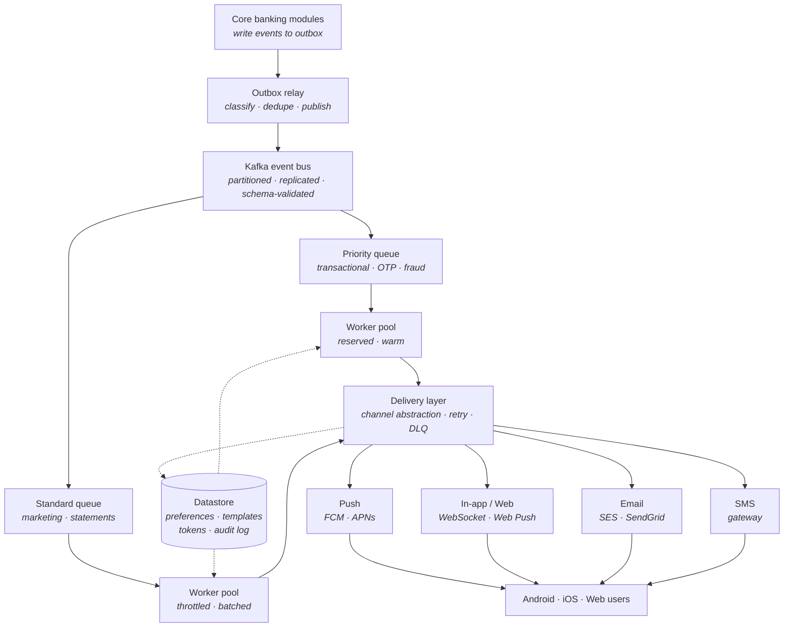

# Approaach A — Architecture Overview

Multi-channel notification platform for the bank's mobile and web applications, serving 1.54M active users across Android, iOS, and web.

> **Purpose of this document.** This is a high-level architecture, not an implementation spec. It defines the components, their responsibilities, the boundaries between them, and the contracts they expose — so that each component can be assigned to an owning team. Each team produces its own detailed design within these boundaries.

---

## 1. Goals and Constraints

A decoupled, horizontally scalable system that delivers notifications over four channels — push (mobile), in-app/web, email, and SMS — by consuming domain events from core banking modules asynchronously.

| Attribute | Target |
|---|---|
| Scalability | 1.54M users; peak bursts up to 5,000 RPS |
| Latency | Transactional alerts under 500 ms end-to-end (p95) |
| Reliability | 99.99% transactional delivery; zero data loss for critical alerts |
| Security | PCI-DSS and GDPR; zero raw PII over public gateways for sensitive categories |

**Out of scope:** the ledger and core transactional engines are unchanged; they integrate only as event producers.

---

## 2. System Architecture

Core banking modules write events to their outbox; a relay publishes them to Kafka, which routes by priority. Worker pools process events and hand them to a delivery layer that fans out to four channels.

Mermaid source

Two architectural decisions shape the whole system:

- **Decoupling via the outbox.** Producers write events transactionally to an outbox; a relay publishes to Kafka. Producers never call the notification system directly and are never blocked by it.
- **Priority separation.** Transactional and marketing traffic run on physically separate streams and worker pools, so a marketing burst can never delay a transactional alert. This is what protects the latency target.

---

## 3. Components and Ownership

Each component is an assignable unit of work with a clear responsibility and interface. Detailed internal design is owned by the assigned team.

| Component | Responsibility | Exposes / Consumes |
|---|---|---|
| Outbox relay | Read producer outboxes; classify, deduplicate, publish to Kafka | Consumes outbox rows; produces to Kafka |
| Event bus (Kafka) | Durable, partitioned, replicated, schema-validated transport | Topics; schema registry |
| Worker pools | Consume events; resolve preferences, tokens, templates; fan out per-channel tasks | Consumes Kafka; calls preference/template/registry; produces delivery tasks |
| Preference service | Per-channel, per-category opt-in/opt-out and quiet hours | Read/write preferences API |
| Template service | Versioned, localized templates and rendering | Template read/render API |
| Device registry | User-to-token/subscription mapping; prune stale tokens | Token read/write API |
| Delivery layer | Channel abstraction; retry, DLQ, per-provider throttling, status recording | Provider adapters; writes audit log |
| Connection gateway | Hold live WebSocket connections to web clients; push notifications to connected users in real time | Accepts client WebSockets; consumes delivery tasks for connected users |
| Datastore | Persist preferences, templates, tokens, audit log | Backing store for above services |

**Phased consolidation (initial release).** The table above describes the target architecture, where each component is independently deployable. For the initial release, three of these may start as modules *within the worker service* rather than as separate services: the **preference service**, the **template service**, and the **delivery layer** (provider adapters, retry, DLQ, status recording). This reduces the number of deployables to stand up first and removes network hops from the transactional latency path. The consolidation is a deployment choice, not an architectural one: each merged concern stays behind a clean internal interface shaped like its Section 6 contract, so it can be extracted into a standalone service later without a rewrite. Two constraints apply when delivery runs inside the worker — provider calls must be dispatched off the Kafka consume loop (so a slow provider call cannot stall a partition), and the preference-management API must remain reachable by the mobile and web apps.
---

## 4. Channels

The delivery layer presents a common interface; each channel is an adapter behind it. Adding or swapping a provider is contained within the delivery layer.

| Channel | Mechanism | Notes |
|---|---|---|
| Push (mobile) | FCM (Android), APNs (iOS) | Native OS notifications |
| In-app / Web | WebSocket when the session is live; Web Push when it is not | Persisted to an in-app feed as the durable source of truth |
| Email | Managed email provider | Bounce/open feedback via webhook |
| SMS | Carrier gateway | High cost; reserved mainly for transactional |

A single notification may fan out to multiple channels based on user preference; the highest-criticality alerts can use redundant channels.

---

## 5. Mobile Push Delivery Approaches

Delivering a notification to a mobile device can be done two ways. This choice affects the push channel specifically and is a boundary decision the owning team must make; the rest of the system is unaffected either way.

### Approach 1 — Provider gateways (FCM / APNs)

The standard path. The app registers a device token; the delivery layer sends notifications through Firebase Cloud Messaging (Android) and the Apple Push Notification service (iOS), which deliver to the OS notification tray.

**Pros**

- **Background delivery guaranteed by the OS.** Notifications arrive even when the app is closed or the device is asleep — the OS wakes to display them. This is the decisive advantage.
- **Battery- and network-efficient.** The OS maintains one shared system connection for all apps; no per-app socket draining the battery.
- **Standard and well-supported.** The expected, documented path on both platforms; mature tooling and reliable at scale.
- **Low operational effort.** No connection infrastructure to run; the providers handle delivery.

**Cons**

- **Third-party dependency.** Delivery relies on Google and Apple infrastructure, outside the bank's control.
- **PII exposure on the gateway.** Payloads transit a third party and can surface on the lock screen, requiring the generic-payload + authenticated-pull policy for sensitive categories.
- **Token lifecycle management.** Tokens rotate and expire; the registry must continuously prune stale tokens.
- **No delivery guarantee or timing control.** Providers may throttle or delay (especially low-priority/silent pushes); the bank cannot tune this.

### Approach 2 — Self-managed persistent connection (no FCM/APNs)

The app holds its own persistent connection (e.g. a WebSocket or long-lived socket) to a bank-operated gateway while running, and receives notifications directly over it — bypassing Google and Apple entirely.

**Pros**

- **No third-party dependency.** Delivery is entirely within the bank's infrastructure; full control over the path.
- **No PII on external gateways.** Content never transits Google/Apple, simplifying the compliance story for sensitive data.
- **Full control over timing and payload.** No provider throttling; the bank tunes delivery behavior.
- **Real-time in-session delivery.** Instant push while the app is open, with no external hop.

**Cons**

- **No reliable background delivery.** The killer limitation: mobile operating systems suspend or kill background app connections to save battery, so a self-managed socket does not work when the app is closed. Time-critical alerts (OTP, fraud) would not arrive reliably. This is why the approach cannot stand alone.
- **Battery and network cost.** Keeping a socket alive drains battery and data; the OS actively fights long-lived per-app connections.
- **High operational burden.** The bank runs and scales a stateful connection gateway sized for concurrent open sockets — a significant undertaking at 1.54M users.
- **Platform friction.** Works against OS design; background-execution limits on both platforms make it fragile.

### Recommendation

**Approach 1 (FCM/APNs) is the primary path** because only the OS-level providers guarantee background delivery — essential for transactional alerts when the app is closed. Approach 2 is a useful **complement, not a replacement**: a self-managed socket delivers instantly while the app is open (avoiding a redundant external hop for in-session notifications), with FCM/APNs as the fallback for background delivery. A self-managed-only design is not viable for a banking app because it cannot reliably deliver security alerts to a closed app.

---

## 6. Contracts and Boundaries

The interfaces below are the stable seams between teams. They are defined here so that each component can be built, tested, and deployed independently against a shared agreement. Internals may change freely as long as these contracts hold. Changes to a contract follow the evolution rules in Section 6.6 — never a silent breaking change.

The guiding seams:

- **Producer → notification system.** Core modules emit events conforming to the canonical event schema (6.2), owned and versioned centrally, enforced by the schema registry. Producers depend only on this contract, never on notification internals.
- **Category drives routing and policy.** Every event declares a category (transactional vs marketing). Category determines the topic, the worker pool, and the content/PII policy applied at delivery.
- **Delivery layer → providers.** Each channel is a provider adapter behind a common interface; the rest of the system is provider-agnostic.
- **Idempotency key.** Carried end to end on every event and delivery task; the mechanism by which duplicates are collapsed and retries stay safe.

### 6.1 Kafka Topics

Producers and consumers share one definition of every topic. Partition count is the ceiling on consumer parallelism and is sized against the peak-rate model (Section 8). All event topics are keyed by `user_id` so per-user ordering is preserved and load spreads evenly.

| Topic | Purpose | Partition key | Notes |
|---|---|---|---|
| `notifications.transactional` | Transactional events (OTP, fraud, payment) | `user_id` | High partition count; consumed by the reserved warm worker pool |
| `notifications.marketing` | Marketing / informational events | `user_id` | Consumed by the throttled worker pool |
| `notifications.dlq` | Dead-letter for events/tasks that exhaust retries | `user_id` | Monitored; supports replay |

Per-topic configuration (partition count, replication factor, retention) is owned by the event-bus team and agreed with producer and consumer teams before launch. Replication factor is set for durability (no data loss on broker failure); retention is set long enough to allow replay within the operational window.

### 6.2 Event Payload Schema

The single canonical contract between core banking producers and the notification system. Registered with the schema registry as Avro or Protobuf so breaking changes are mechanically rejected. Every event conforms to this shape.

| Field | Type | Required | Description |
|---|---|---|---|
| `schema_version` | string | yes | Contract version, e.g. `1.0`, for compatibility handling |
| `event_id` | UUID | yes | Globally unique ID for this event |
| `idempotency_key` | string | yes | Stable key for the originating business action; used to deduplicate |
| `user_id` | UUID | yes | Recipient; also the partition key |
| `category` | enum | yes | `transactional` or `marketing`; determines topic and policy |
| `type` | string | yes | Specific event type, e.g. `money_received`, `otp`, `fraud_alert`, `statement_ready`, `campaign` |
| `template_id` | string | yes | Identifier of the template used to render content |
| `data` | map<string,string> | yes | Fields the template needs; excludes raw PII for sensitive types |
| `locale` | string | no | Preferred language/locale; falls back to user preference if absent |
| `priority` | enum | no | `high` or `normal`; defaults from `category` if absent |
| `created_at` | timestamp | yes | Event creation time (UTC, ISO-8601 / epoch-millis) |
| `correlation_id` | UUID | yes | Trace ID propagated end to end |

**Rules:** for sensitive types (`otp`, `fraud_alert`, money/transaction types) the `data` map carries only what is needed to render generic gateway text and to let the app fetch detail after authentication — never full account numbers, balances, or counterparty detail that would transit a public gateway.

### 6.3 Endpoint Contracts (synchronous services)

The worker calls these services during processing. Each contract specifies request, response, error behavior, and a latency budget — the budget matters because these calls sit inside the worker's sub-500 ms transactional path. Full request/response schemas are maintained as OpenAPI specs owned by each service team; the summary below is the agreed shape.

| Service | Operation | Request → Response | Error behavior | Latency budget |
|---|---|---|---|---|
| Preference service | Resolve delivery decision | `{user_id, category}` → `{channels_enabled[], quiet_hours}` | Unknown user → empty set (fail closed for marketing; security types bypass) | ≤ 50 ms p99 |
| Template service | Render content | `{template_id, locale, data}` → `{rendered_per_channel}` | Missing template → error; high-priority may use last-known-good | ≤ 50 ms p99 |
| Device registry | Resolve targets | `{user_id}` → `{tokens[]: {channel, token, status}}` | No valid token → empty set; caller falls back to other channels | ≤ 30 ms p99 |
| Device registry | Register / prune token | `{user_id, channel, token, status}` → `{ack}` | Invalid on provider rejection → prune | ≤ 50 ms p99 |
| Preference service | Read / update preferences | `{user_id, channel, category, enabled, quiet_hours}` → `{ack}` | Reject disabling a non-suppressible security category | ≤ 100 ms p99 |

### 6.4 Delivery-Task Contract

The worker emits one delivery task per enabled channel. When delivery is a separate service this is a cross-service message; when delivery runs inside the worker (see the phased-consolidation note in Section 3) it is the same shape as an internal interface, so the boundary is preserved either way.

| Field | Type | Description |
|---|---|---|
| `task_id` | UUID | Unique per task |
| `idempotency_key` | string | Carried from the originating event; deduplicates at the provider |
| `user_id` | UUID | Recipient |
| `channel` | enum | `push` `in_app_web` `email` `sms` |
| `target` | string | Token, subscription, address, or connection reference |
| `category` | enum | Drives the content/PII policy applied before dispatch |
| `payload` | object | Rendered content (already PII-stripped for sensitive categories) |
| `correlation_id` | UUID | Propagated for tracing and audit |

### 6.5 Connection Gateway Contract (WebSocket)

The connection gateway has two contracts: an inbound one for receiving notifications to deliver, and a client-facing one for the web app's live connection.

**Inbound — delivery layer / worker → gateway.** A notification destined for a connected web user is handed to the gateway using the delivery-task shape (6.4) with `channel: in_app_web`. The gateway looks up the user's live connection and pushes the payload down it. If the user has no active connection, the gateway reports the task as undeliverable-live; the notification remains in the persisted in-app feed for retrieval on next connect (see note below).

**Client-facing — web app ↔ gateway.** The contract the browser depends on:

| Aspect | Contract |
|---|---|
| Connect | Client opens an authenticated WebSocket (bearer token / session) to the gateway; gateway validates and registers the `user_id → connection` mapping |
| Message (server → client) | `{notification_id, type, title, body, category, created_at}` pushed over the socket |
| Acknowledgement | Client acks receipt by `notification_id` so the gateway can mark live-delivered |
| Heartbeat | Periodic ping/pong to detect dead connections and prune the mapping |
| Disconnect | On close, gateway removes the mapping; missed notifications are read from the in-app feed on reconnect |

**Persistence boundary.** Because a WebSocket only exists while the tab is open and can drop unexpectedly, every web notification is also written to the persisted in-app feed (in the datastore). The live push is a best-effort accelerator; the feed is the durable source of truth the client reconciles against on connect or reload. This guarantees a dropped socket never means a lost notification.

**Scaling note (not a contract, but a boundary constraint).** The gateway is stateful and scales by concurrent open connections, unlike the stateless worker. If it runs as more than one node, delivering to a socket held by another node requires a shared backplane (pub/sub or a Kafka topic keyed by user/node). A single-node deployment can omit the backplane initially.

### 6.6 Contract Evolution Rules

Contracts are stable seams, but they must be able to change without breaking teams.

- **Backward compatibility.** New fields are optional with defaults; existing fields are never removed or retyped in place. The schema registry enforces this for the event schema.
- **Versioning.** A breaking change requires a new `schema_version` (events) or an API version (endpoints), with a migration window during which both are accepted.
- **Review.** Contract changes are reviewed with all affected teams before merge, not applied unilaterally.
- **Contract testing.** Each component ships tests asserting it honors the shared contract, so a breaking change is caught in CI rather than at integration.

---

## 7. Cross-Cutting Principles

These apply system-wide and constrain every component's design.

- **Reliability.** At-least-once delivery with end-to-end idempotency; durable outbox and replicated Kafka mean no accepted critical event is lost; exhausted deliveries land in a dead-letter queue for replay, never a silent drop.
- **Graceful degradation.** Under overload or dependency failure, transactional traffic is protected at the expense of marketing. Sensitive categories fail closed (withhold rather than send incorrect/unauthorized content); non-suppressible security alerts fail open.
- **Security.** Zero raw PII over public gateways for sensitive categories — generic payloads transit third parties, full content is pulled by the authenticated app. TLS in transit, encryption at rest, immutable audit log, consent enforced and revocable.
- **Observability.** Per-notification status and per-channel latency/error metrics, measured against the targets in Section 1.

---
