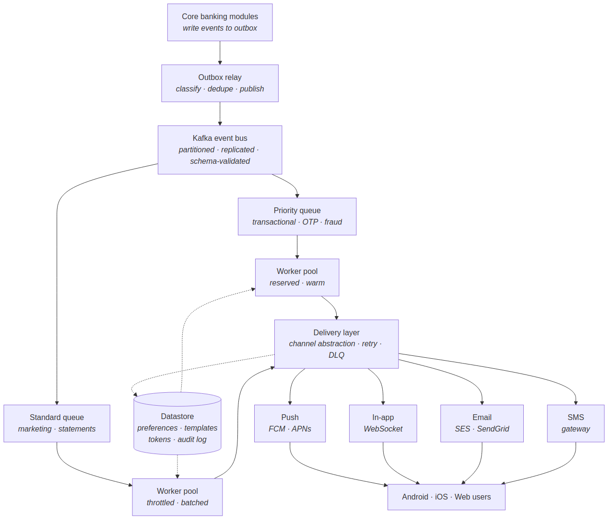
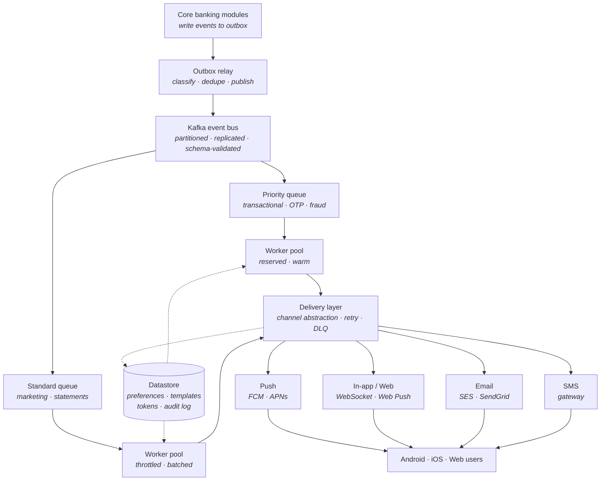

# Notification System — Architecture Overview

Multi-channel notification platform for the bank's mobile and web applications, serving 1.54M active users across Android, iOS, and web.

> **Purpose of this document.** This is a high-level architecture, not an implementation spec. It defines the components, their responsibilities, the boundaries between them, and the contracts they expose — so that each component can be assigned to an owning team. Each team produces its own detailed design within these boundaries.

---

## 1. Goals and Constraints

A decoupled, horizontally scalable system that delivers notifications over four channels — push (mobile), in-app/web, email, and SMS — by consuming domain events from core banking modules asynchronously.

| Attribute | Target |
|---|---|
| Scalability | 1.54M users; peak bursts up to 5,000 RPS |
| Latency | Transactional alerts under 500 ms end-to-end (p95) |
| Reliability | 99.99% transactional delivery; zero data loss for critical alerts |
| Security | PCI-DSS and GDPR; zero raw PII over public gateways for sensitive categories |

**Out of scope:** the ledger and core transactional engines are unchanged; they integrate only as event producers.

---

## 2. System Architecture

Core banking modules write events to their outbox; a relay publishes them to Kafka, which routes by priority. Worker pools process events and hand them to a delivery layer that fans out to four channels.

Mermaid source

Two architectural decisions shape the whole system:

- **Decoupling via the outbox.** Producers write events transactionally to an outbox; a relay publishes to Kafka. Producers never call the notification system directly and are never blocked by it.
- **Priority separation.** Transactional and marketing traffic run on physically separate streams and worker pools, so a marketing burst can never delay a transactional alert. This is what protects the latency target.

---

## 3. Components and Ownership

Each component is an assignable unit of work with a clear responsibility and interface. Detailed internal design is owned by the assigned team.

| Component | Responsibility | Exposes / Consumes |
|---|---|---|
| Outbox relay | Read producer outboxes; classify, deduplicate, publish to Kafka | Consumes outbox rows; produces to Kafka |
| Event bus (Kafka) | Durable, partitioned, replicated, schema-validated transport | Topics; schema registry |
| Worker pools | Consume events; resolve preferences, tokens, templates; fan out per-channel tasks | Consumes Kafka; calls preference/template/registry; produces delivery tasks |
| Preference service | Per-channel, per-category opt-in/opt-out and quiet hours | Read/write preferences API |
| Template service | Versioned, localized templates and rendering | Template read/render API |
| Device registry | User-to-token/subscription mapping; prune stale tokens | Token read/write API |
| Delivery layer | Channel abstraction; retry, DLQ, per-provider throttling, status recording | Provider adapters; writes audit log |
| Connection gateway | Hold live WebSocket connections to web clients; push notifications to connected users in real time | Accepts client WebSockets; consumes delivery tasks for connected users |
| Datastore | Persist preferences, templates, tokens, audit log | Backing store for above services |

---

## 4. Channels

The delivery layer presents a common interface; each channel is an adapter behind it. Adding or swapping a provider is contained within the delivery layer.

| Channel | Mechanism | Notes |
|---|---|---|
| Push (mobile) | FCM (Android), APNs (iOS) | Native OS notifications |
| In-app / Web | WebSocket when the session is live; Web Push when it is not | Persisted to an in-app feed as the durable source of truth |
| Email | Managed email provider | Bounce/open feedback via webhook |
| SMS | Carrier gateway | High cost; reserved mainly for transactional |

A single notification may fan out to multiple channels based on user preference; the highest-criticality alerts can use redundant channels.

---

## 5. Mobile Push Delivery Approaches

Delivering a notification to a mobile device can be done two ways. This choice affects the push channel specifically and is a boundary decision the owning team must make; the rest of the system is unaffected either way.

### Approach 1 — Provider gateways (FCM / APNs)

The standard path. The app registers a device token; the delivery layer sends notifications through Firebase Cloud Messaging (Android) and the Apple Push Notification service (iOS), which deliver to the OS notification tray.

**Pros**

- **Background delivery guaranteed by the OS.** Notifications arrive even when the app is closed or the device is asleep — the OS wakes to display them. This is the decisive advantage.
- **Battery- and network-efficient.** The OS maintains one shared system connection for all apps; no per-app socket draining the battery.
- **Standard and well-supported.** The expected, documented path on both platforms; mature tooling and reliable at scale.
- **Low operational effort.** No connection infrastructure to run; the providers handle delivery.

**Cons**

- **Third-party dependency.** Delivery relies on Google and Apple infrastructure, outside the bank's control.
- **PII exposure on the gateway.** Payloads transit a third party and can surface on the lock screen, requiring the generic-payload + authenticated-pull policy for sensitive categories.
- **Token lifecycle management.** Tokens rotate and expire; the registry must continuously prune stale tokens.
- **No delivery guarantee or timing control.** Providers may throttle or delay (especially low-priority/silent pushes); the bank cannot tune this.

### Approach 2 — Self-managed persistent connection (no FCM/APNs)

The app holds its own persistent connection (e.g. a WebSocket or long-lived socket) to a bank-operated gateway while running, and receives notifications directly over it — bypassing Google and Apple entirely.

**Pros**

- **No third-party dependency.** Delivery is entirely within the bank's infrastructure; full control over the path.
- **No PII on external gateways.** Content never transits Google/Apple, simplifying the compliance story for sensitive data.
- **Full control over timing and payload.** No provider throttling; the bank tunes delivery behavior.
- **Real-time in-session delivery.** Instant push while the app is open, with no external hop.

**Cons**

- **No reliable background delivery.** The killer limitation: mobile operating systems suspend or kill background app connections to save battery, so a self-managed socket does not work when the app is closed. Time-critical alerts (OTP, fraud) would not arrive reliably. This is why the approach cannot stand alone.
- **Battery and network cost.** Keeping a socket alive drains battery and data; the OS actively fights long-lived per-app connections.
- **High operational burden.** The bank runs and scales a stateful connection gateway sized for concurrent open sockets — a significant undertaking at 1.54M users.
- **Platform friction.** Works against OS design; background-execution limits on both platforms make it fragile.

### Recommendation

**Approach 1 (FCM/APNs) is the primary path** because only the OS-level providers guarantee background delivery — essential for transactional alerts when the app is closed. Approach 2 is a useful **complement, not a replacement**: a self-managed socket delivers instantly while the app is open (avoiding a redundant external hop for in-session notifications), with FCM/APNs as the fallback for background delivery. A self-managed-only design is not viable for a banking app because it cannot reliably deliver security alerts to a closed app.

---

## 6. Contracts and Boundaries

The interfaces below are the stable seams between teams. Internals may change freely as long as these hold.

- **Producer → notification system.** Core modules emit events conforming to a single canonical event schema (owned and versioned centrally, enforced by the schema registry). Producers depend only on this contract, never on notification internals.
- **Category drives routing and policy.** Every event declares a category (transactional vs marketing). Category determines the stream, the worker pool, and the content/PII policy applied at delivery.
- **Delivery layer → providers.** Each channel is a provider adapter behind a common interface; the rest of the system is provider-agnostic.
- **Idempotency key.** Carried end to end on every event and delivery task; the mechanism by which duplicates are collapsed and retries stay safe.

---

## 7. Cross-Cutting Principles

These apply system-wide and constrain every component's design.

- **Reliability.** At-least-once delivery with end-to-end idempotency; durable outbox and replicated Kafka mean no accepted critical event is lost; exhausted deliveries land in a dead-letter queue for replay, never a silent drop.
- **Graceful degradation.** Under overload or dependency failure, transactional traffic is protected at the expense of marketing. Sensitive categories fail closed (withhold rather than send incorrect/unauthorized content); non-suppressible security alerts fail open.
- **Security.** Zero raw PII over public gateways for sensitive categories — generic payloads transit third parties, full content is pulled by the authenticated app. TLS in transit, encryption at rest, immutable audit log, consent enforced and revocable.
- **Observability.** Per-notification status and per-channel latency/error metrics, measured against the targets in Section 1.

---
